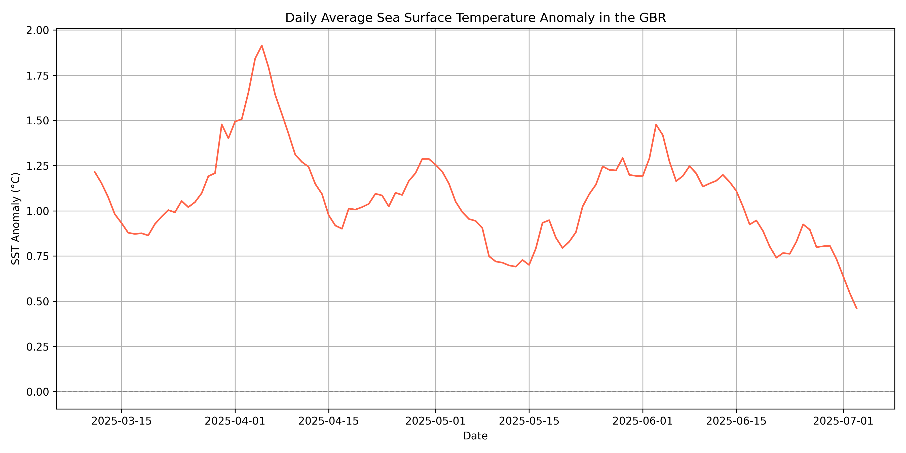
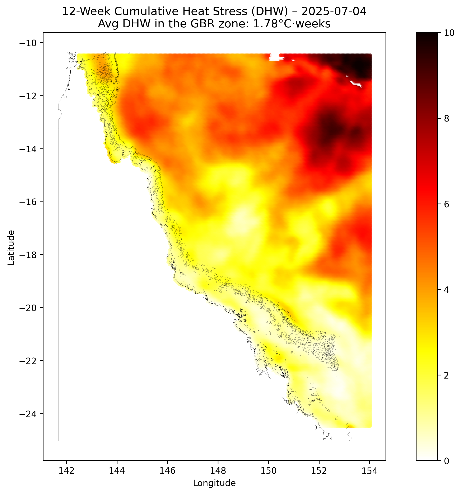

# 🌊 Coral Bleaching Live Map

This project monitors sea surface temperature anomalies (SSTAs) and coral bleaching risk near the **Great Barrier Reef (GBR)**, updating daily using data from the **NOAA ERDDAP API**.

It is intended to raise awareness of marine heatwaves and coral bleaching events linked to climate change.

## Outputs

### 1. Daily Average Sea Surface Temperature Anomaly (GBR)


This graph shows the daily average deviation from normal temperatures within the GBR polygon. Positive anomalies (in red) indicate above-normal temperatures that may contribute to coral stress.

1. **Raw data**: We fetch CSV files from NOAA’s ERDDAP API. Each file includes:
   - `latitude`, `longitude`, `time`
   - `sea_surface_temperature_anomaly` (in °C)

2. **Spatial filtering**:
   - The Great Barrier Reef polygon is loaded from a shapefile (`.shp`) from the UNESCO World Heritage Marine Programme.
   - Only points **within** this polygon are used.

3. **Aggregation**:
   - Daily SST anomalies are averaged over all GBR points.

### 2. Degree Heating Weeks (DHW)


This graph accumulates thermal stress over time. 
DHW ≥ 2 °C-weeks indicates **mild Stress**,
DHW ≥ 4 °C-weeks indicates **significant bleaching risk**,
DHW ≥ 8 °C-weeks often leads to **widespread coral mortality**.

**DHW calculation**:
   - For each day and location:
     - SST anomaly values are accumulated **only when they exceed 1 °C**.
     - The sum of these values over the **last 84 days (12 weeks)** is calculated and divided by 7 to get °C-weeks.
   - We then map out this DHW over a shapefile of the Great Barrier Reef.

## 🛠️ Setup

Install required packages:

```bash
pip install pandas geopandas matplotlib shapely
